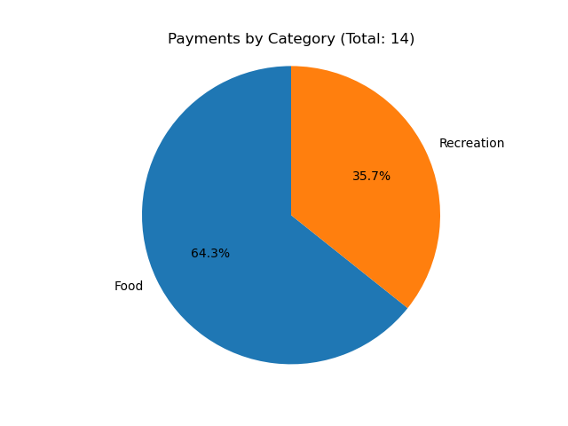
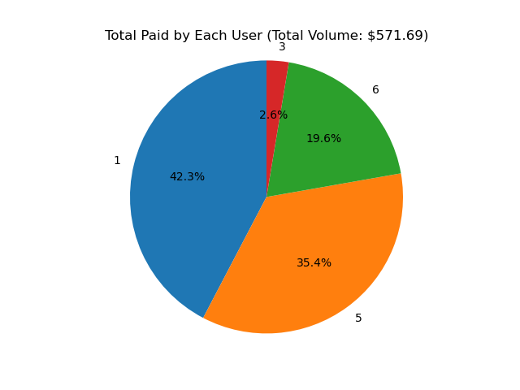
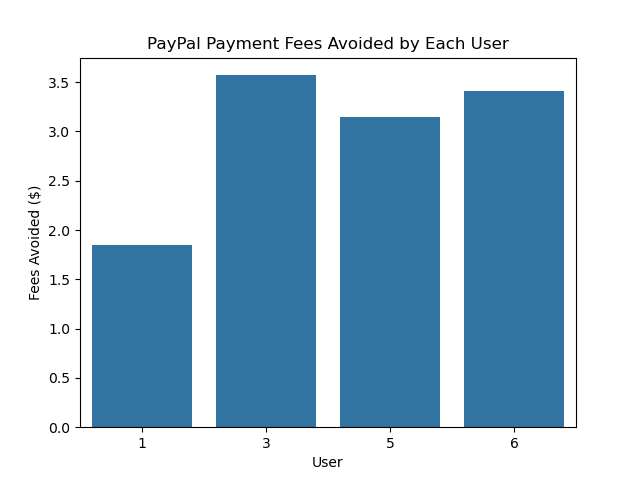
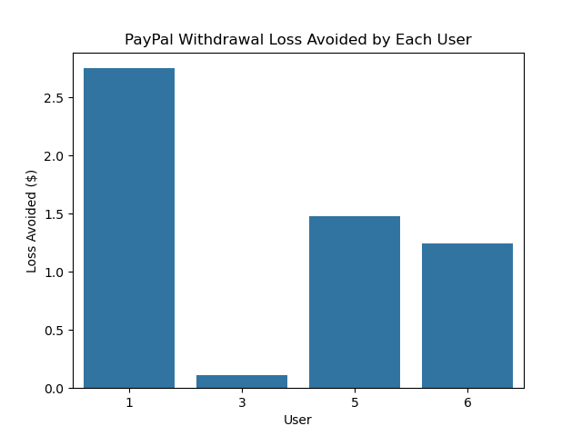
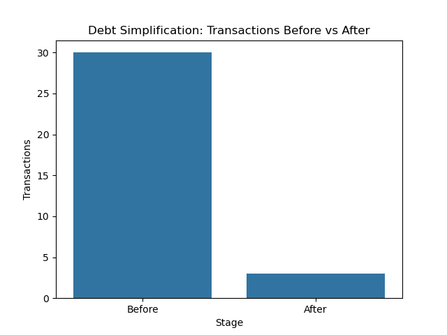

# Debt Tracker

A full-stack web application for simplifying group expenses, reducing debt cycles, and saving money on third-party payment services like PayPal.

## Overview

Whenever I'd go out with friends, It would always be inevitable for some expenses to be shared, such as restaurants being unable to split a bill, an Uber ride, or preordering movie tickets.
This led me to always be thinking about the easiest ways for these shared debts to be paid off in one go, leading me to develop this tool.
**Debt Tracker** is a tool I built for my friends and I to track shared expenses. The app:
- Allows users to register accounts and add friends
- Records payments made by individual users
- Splits expenses among selected friends
- Minimizes transactions through debt simplification
- Only transfers debt to those who are your friends (you will not owe anyone you don't know)

Over 1 week of real-world testing, my app facilitated $571.69 in shared payments and reduced 30 manual peer debts into just 2 final transactions,
saving $17.57 in fees that could’ve gone to PayPal. Projected over a year, this system could save over $900 in transaction costs across a small friend group.

## Example

Alice, Charlie, and Bob go out to have dinner together. The ride costs $30, which Alice pays for. Now, Charlie and Bob owe Alice $10 each.
Dinner costs a total of $60. Bob pays, and Alice owes Bob $15 for her meal, and Charlie owes Bob $25 for his.
Without simplification, four total transactions would occur, two each time a payment is made.
With cancellation, Alice owes Bob $5, Charlie owes Alice $10, and Charlie owes Bob $25.
With transferrals, Charlie owes Alice $5, and Charlie owes Bob $30. What were four payments have been reduced to two.

While this may not seem like much of a difference, these debt networks can rapidly become extremely complicated and difficult to track.
If payments were always made immediately, the fees from services such as PayPal can gradually build up in very small increments and lead to large financial losses.
---

## Experimental Insights

I tested this app with my four friends for a week, and these are the results.

### Payments by Category (Total: 14)

  

This shows the distribution of payments by category. Over time, more categories could be added, but these food and recreation were identified as the clear two categories over this week.

### Total Paid by Each User (Total Volume: $571.69)

  

A total of $571.69 was spent between the four of us. This chart shows made the most payments and thus accrued the most credit (having the most amount of people owe them)
For the sake of privacy, there are no names but user IDs as logged by the database.

### Potential PayPal Fees Avoided by Each Debtor

  

Paypal charges a %2.9 + $0.3 fee for each payment sent to another person. This chart shows how much each person avoided paying.

### Would-be PayPal Losses for Creditors

  

Paypal also charges a %1.5 fee to transfer money to your bank account. This chart shows how much each person avoided losing.

### Payment Simplification

  

This chart shows the before and afters for the amount of payments needed to be made to pay off all debts.
What were 30 payments have become 3. However, one of these 3 payments was 8 cents, making it effectively negligible.
Thus, 30 payments became 2.

The total PayPal fees avoided come out to $17.57. Over a year, assuming 52 weeks in a year, $913.64 could potentially be avoided.
